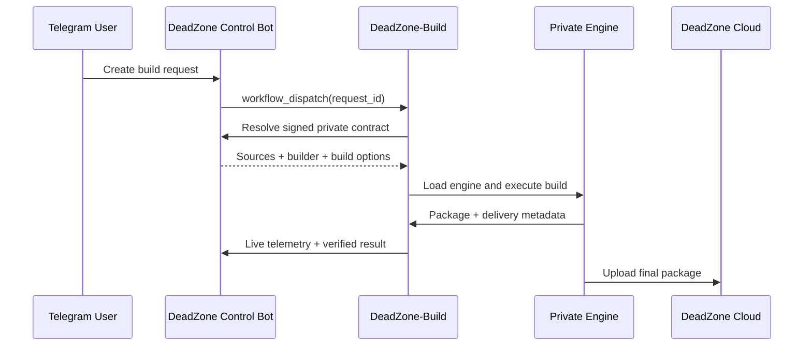

<p align="center">
  
</p>

<h1 align="center">☠️ DeadZone Build System</h1>

<p align="center">
  <b>One launcher • Multiple engines • Private contracts • Live telemetry • Verified delivery</b>
</p>

<p align="center">
  <a href="https://t.me/xDeadZone">🔥 Updates</a> •
  <a href="https://t.me/DeadZoneDiscussion">💬 Discussion</a> •
  <a href="https://t.me/DeadZoneCloud">☁️ Cloud</a> •
  <a href="https://deadzone.web.id/">🌐 Website</a>
</p>

---

## ⚡ Overview

**DeadZone-Build** is the public GitHub Actions launcher for the DeadZone ROM ecosystem.

The repository contains the orchestration layer only. Build engines stay isolated from the public launcher and are loaded at runtime through repository secrets. Control Bot requests expose only an opaque DeadZone request ID; ROM URLs, Telegram identity and private build options are resolved through the signed DeadZone contract.

```text
Telegram / GitHub
       │
       ▼
┌──────────────────────┐
│   DeadZone-Build     │
│  Public Launcher     │
└──────────┬───────────┘
           │ signed contract / manual inputs
           ▼
┌──────────────────────┐
│  Private Build Engine│
│ Lite / Gaming / ...  │
└──────────┬───────────┘
           │
           ▼
 Build → Pack → Verify → DeadZone Cloud
```

---

## 🧩 DeadZone Editions

| Edition | Purpose | Input model | Launcher status |
|---|---|---|---|
| ⚡ **DeadZone - Lite** | Main Xiaomi MIUI / HyperOS build pipeline with automatic detection, extraction, modifications, repacking and delivery. | One ROM source | ✅ Production |
| 🎮 **DeadZone GamingPlus** | Gaming-focused build path with performance-oriented modifications and the DeadZone delivery contract. | One ROM source | ✅ Production |
| 🥷 **DeadZone Ninja** | Framework / JAR modification system for Android framework features and targeted patch sets. | Android + device + ROM metadata + selected JAR inputs | ✅ Production |
| 🛠️ **DeadZone Port** | Dual-ROM porting engine that combines a target Stock ROM with a donor Port ROM, then rebuilds and validates the final dynamic-partition package. | **Stock ROM + Port ROM** | ✅ New launcher workflow |
| 👑 **DeadZone Legend** | Reserved DeadZone edition for the next build profile and feature set. | Defined when the engine contract is finalized | 🧪 Planned |

### ⚡ DeadZone - Lite

Lite is the standard DeadZone ROM engine. It receives one supported ROM package and runs the full build journey:

```text
ROM → Detect → Extract → Modify → Repack → Upload → Verify
```

Canonical workflow:

```text
.github/workflows/MEZO_Lite.yml
```

It supports both Control Bot requests and manual GitHub execution.

### 🎮 DeadZone GamingPlus

GamingPlus is the performance-oriented DeadZone build profile. The public launcher resolves the private build request, loads the GamingPlus engine and reports live stages back to DeadZone System.

Canonical workflow:

```text
.github/workflows/gamingplus.yml
```

### 🥷 DeadZone Ninja

Ninja is the user-facing identity for the FrameworkPatcher build path. It handles Android-version-aware framework modifications and can accept the JAR inputs required by each selected feature.

Canonical workflow:

```text
.github/workflows/frameworkpatcher.yml
```

The engine remains compatible with the existing FrameworkPatcher contract while the DeadZone product identity is **DeadZone Ninja**.

### 🛠️ DeadZone Port

Port is a different build class from Lite and GamingPlus because it requires **two independent ROM sources**:

```text
Target Stock ROM ─┐
                  ├─► Detect / Extract / Merge / Patch / Repack / Upload
Donor Port ROM  ──┘
```

Canonical workflow:

```text
.github/workflows/DeadZone_Port.yml
```

The workflow follows the real Port engine contract:

1. Resolve the Stock ROM and donor Port ROM.
2. Load and validate the private Port engine.
3. Run repository validation and the dual-ROM merge smoke test.
4. Install the Port extraction / APK / JAR / Super toolchain.
5. Execute `build.sh <STOCK_ROM> <PORT_ROM>`.
6. Rebuild dynamic partitions with `packROM.sh`.
7. Upload through `uploadROM.sh`.
8. Create a checksum-free `deadzone-result.json` contract for DeadZone System.

Manual runs are available from **Actions → DeadZone Port** and require both `stock_rom_link` and `port_rom_link`.

### 👑 DeadZone Legend

Legend is part of the DeadZone edition catalog but does not have an active production launcher yet. Its workflow will be added only when the engine inputs, result contract and validation requirements are finalized.

---

## 🤖 Control Bot Contract

Control Bot workflows are designed around opaque request IDs such as:

```text
DZ-LT-YYYYMMDD-0001
DZ-GP-YYYYMMDD-0001
DZ-PT-YYYYMMDD-0001
```

The public workflow never needs the ROM URL or Telegram identity in the dispatch payload. The runner resolves private data using an HMAC-signed request to DeadZone System.



---

## 🚀 Manual GitHub Builds

Workflows that expose manual inputs can also run directly from the **Actions** tab.

| Workflow | Manual input |
|---|---|
| `MEZO_Lite.yml` | ROM link |
| `frameworkpatcher.yml` | Android, device, ROM version, features and JAR sources |
| `DeadZone_Port.yml` | Stock ROM link + donor Port ROM link |

A manual build uses the GitHub actor or the optional builder label where supported. Control Bot availability is not required for purely manual input mode.

---

## 🔐 Repository Secrets

The launcher expects configuration through GitHub Actions secrets. Private engine repository names must not be hardcoded into workflow files.

### Engine routing

```text
LITE_ENGINE_REPOSITORY
GAMINGPLUS_ENGINE_REPOSITORY
FRAMEWORK_ENGINE_REPOSITORY
FRAMEWORK_MODULE_REPOSITORY
PORT_ENGINE_REPOSITORY
PRIVATE_REPO_TOKEN
```

### DeadZone contract and telemetry

```text
BUILD_PROGRESS_SECRET
```

### Cloud delivery

```text
RCLONE_CONFIG_BASE64
RCLONE_REMOTE_NAME
RCLONE_UPLOAD_DIR
RCLONE_PUBLIC_LINK_BASE
```

Additional Telegram / release secrets may be used by engines that own their own manual notification flow.

> Never commit repository tokens, cloud configuration, Telegram tokens, signing material or private engine locations into this public launcher.

---

## 📦 Verified Result Contract

Production launcher workflows publish a minimal result artifact named:

```text
deadzone-result-<REQUEST_ID>
```

The contained `deadzone-result.json` exposes only the information required by DeadZone System to verify delivery:

```json
{
  "schema_version": "1.0",
  "request_id": "DZ-XX-YYYYMMDD-0001",
  "project": "edition-key",
  "status": "success",
  "provider": "google_drive",
  "url": "https://...",
  "file_name": "DeadZone_....zip",
  "size": 0,
  "completed_at": "ISO-8601"
}
```

Checksums and sensitive build internals stay inside the private engine workspace.

---

## 📊 Live Build Stages

DeadZone System uses one normalized progress model across build engines:

```text
Preparing
   ↓
Loading Engine
   ↓
Installing Tools
   ↓
Building
   ↓
Packaging
   ↓
Preparing Upload
   ↓
Uploading
   ↓
Finalizing
   ↓
Verified
```

`scripts/emit_stage.sh` is observability-only: telemetry failure must never stop an otherwise valid ROM build.

---

## 🛡 Architecture Rules

- The public launcher contains orchestration, not private engine source.
- New Control Bot builds dispatch an opaque request ID only.
- Private inputs are resolved through the signed contract.
- Every production build must be reproducible from its recorded engine workflow.
- Result artifacts expose delivery metadata, not credentials or private checksums.
- Build queues remain serialized per edition unless an engine is explicitly designed for parallel execution.
- A new edition is marked Production only after its input contract, validation path, packaging path and verified result contract are defined.

---

## 🗺 Repository Surface

```text
DeadZone-Build/
├── .github/
│   └── workflows/
│       ├── MEZO_Lite.yml
│       ├── gamingplus.yml
│       ├── frameworkpatcher.yml
│       └── DeadZone_Port.yml
├── scripts/
│   ├── emit_stage.sh
│   └── send_telemetry.py
└── README.md
```

Legend will receive its own workflow when its engine is ready for the same production contract.

---

## 👑 DeadZone

Maintained under the **DeadZone ROM ecosystem**.

<p align="center">
  <b>Build clean. Keep engines private. Deliver verified.</b>
</p>
